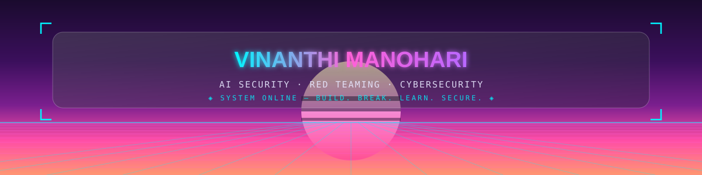

  

 

  

 

<table width="100%">
  <tr>
    <td width="33%" valign="top" align="center">
      <strong>ROLE</strong> 
      Computer Science Engineering Student
    </td>
    <td width="34%" valign="top" align="center">
      <strong>FOCUS</strong> 
      AI Security · Red Teaming · Cybersecurity
    </td>
    <td width="33%" valign="top" align="center">
      <strong>FLAGSHIP</strong> 
      Pulse — AI Security Eval Platform
    </td>
  </tr>
</table>

 

  
   
  ✦ "Build. Break. Learn. Secure." ✦

 

  
  
  
  
    
  
  

 

  

 

<table width="100%">
  <tbody>
    <tr>
      <td width="50%" valign="top" align="center">
        <strong>🧬 Pulse</strong> 
        
          
        Modular AI Security Evaluation & Research Platform — flagship project for testing, evaluating, and red-teaming AI systems.
      </td>
      <td width="50%" valign="top" align="center">
        <strong>🎣 PhishGuard</strong> 
        
          
        URL-based phishing detection and analysis tool for catching malicious links before they cause harm.
      </td>
    </tr>
    <tr>
      <td width="50%" valign="top" align="center">
        <strong>🔑 Password Strength Checker</strong> 
        
          
        Python-based credential security assessment tool.
      </td>
      <td width="50%" valign="top" align="center">
        <strong>📡 Network Packet Sniffer</strong> 
        
          
        Packet capture and traffic analysis for understanding what's moving on the wire.
      </td>
    </tr>
    <tr>
      <td width="50%" valign="top" align="center">
        <strong>🔐 Basic Encryption & Decryption</strong> 
        
          
        Classical cryptography implementation in Python — the fundamentals, done right.
      </td>
      <td width="50%" valign="top" align="center">
        <strong>🛡️ Secure Coding Review</strong> 
        
          
        Static security analysis and secure coding practices applied to real codebases.
      </td>
    </tr>
  </tbody>
</table>

 

  

 

  
  
  
    
  
  
  

 

  

 

  

 

<table width="100%">
  <tr>
    <td width="50%" valign="top" align="center">
      <strong>◈ CURRENTLY LEARNING</strong>
        
      <code>AI Security Engineering</code> 
      <code>AI Red Teaming Methodologies</code> 
      <code>LLM Security</code> 
      <code>Offensive Security Fundamentals</code> 
      <code>Secure Coding</code>
    </td>
    <td width="50%" valign="top" align="center">
      <strong>◈ MISSION OBJECTIVES</strong>
        
      <code>Build Pulse into a leading open-source AI Security platform</code> 
      <code>Contribute impactful security tools to open source</code> 
      <code>Become an AI Security Engineer in Red Teaming</code> 
      <code>Build practical tools that secure AI systems</code>
    </td>
  </tr>
</table>

 

  

 

<!-- SIMPLIFIED STATS SECTION - USING ONLY RELIABLE SERVICES -->

  
  <!-- GitHub Stats Card -->
  
  
  <!-- Top Languages -->
  
  
    
  
  <!-- GitHub Streak -->
  
  
    
  
  <!-- Contribution Graph -->
  
  
    
  
  <!-- Snake Animation -->
  
  

 

  

 

  

 

  

 

<table width="100%">
  <tbody>
    <tr>
      <td width="50%" valign="top" align="center">
        <strong>Let's work on something together</strong>
          
        Questions about AI security, red teaming, secure software, or open source? <a href="mailto:manohari1009@gmail.com">Reach out by email</a> — always happy to talk shop.
      </td>
      <td width="50%" valign="top" align="center">
        <strong>Always improving</strong>
          
        
          
        <em>"Security isn't a checkbox, it's a habit."</em>
      </td>
    </tr>
  </tbody>
</table>

 

  
  
  

 

  

